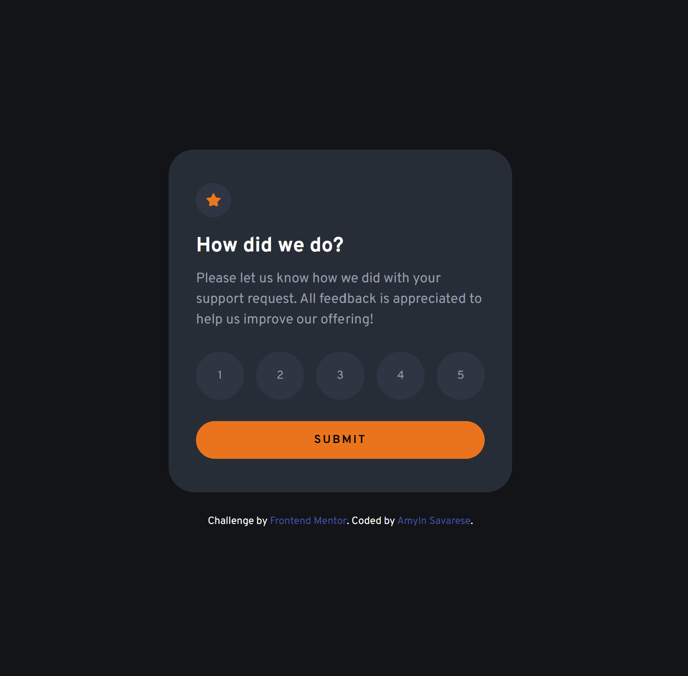
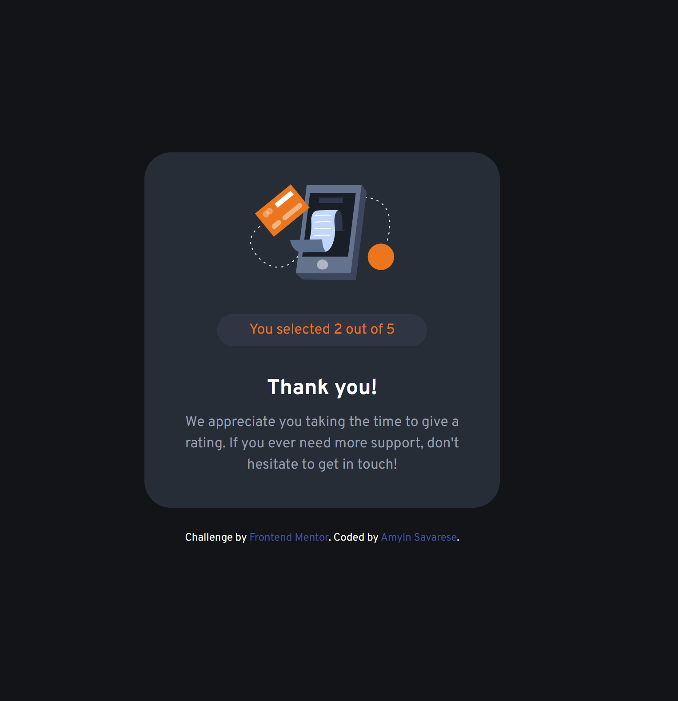

# Frontend Mentor - Interactive rating component solution

This is a solution to the [Interactive rating component challenge on Frontend Mentor](https://www.frontendmentor.io/challenges/interactive-rating-component-koxpeBUmI). Frontend Mentor challenges help you improve your coding skills by building realistic projects. 

## Table of contents

- [Overview](#overview)
  - [The challenge](#the-challenge)
  - [Screenshot](#screenshot)
  - [Links](#links)
- [My process](#my-process)
  - [Built with](#built-with)
  - [What I learned](#what-i-learned)
  - [Code that I'm Proud of](#code-that-im-proud-of)
  - [Continued development](#continued-development)
  - [Useful resources](#useful-resources)
- [Author](#author)


## Overview

### The challenge

Users should be able to:

- View the optimal layout for the app depending on their device's screen size
- See hover states for all interactive elements on the page
- Select and submit a number rating
- See the "Thank you" card state after submitting a rating

### Screenshot

Desktop View




### Links

- Solution URL: [Add solution URL here](https://your-solution-url.com)
- Live Site URL: [Add live site URL here](https://your-live-site-url.com)

## My process

### Built with

- Semantic HTML5 markup
- CSS custom properties
- Flexbox
- Desktop-first workflow
- JavaScript


### What I learned

In this project, I learned more about JavaScript functions, like event listeners, the use of `hidden`, `document.querySelectorAll`, using `let` variables, conditions that use `(variable != "")`, and expanding on the importance of using the console to debug my code, as well as make sure it's connected properly.

- Event listeners are important for when you want something to happen when a user does something, like "click" a button, or for other events that occur in the browser. I should then trigger a callback function when those events happen.
`element.addEventListener(event, callback);`

- The `hidden` class is not a built-in feature of HTML or CSS but is often used as a convention to control the visibility of elements. You define this class in your CSS and then add or remove it as needed.
```css
.hidden {
    display: none;
}
```
- In this CSS definition, any element with the hidden class will be hidden (display: none;), meaning it will not be visible on the page and will not take up any space.
```css
<div id="myElement" class="hidden">This element is hidden</div>
```
- The `div` with `id="myElement"` will not be visible because it has the `hidden` class.

- Selectors are a string containing one or more CSS selectors separated by commas. These selectors are used to match elements in the document. Unlike `document.querySelector`, which returns the first matching element, `querySelectorAll` returns all matching elements.

- If `let` variables are declared outside of any function or block, they are globally scoped. If they are inside of a function, they are only accessible within the block (enclosed by curly braces {}) where they are defined.

- I explained what I learned about `(variable != "")` I think further down in my README file.

- It's very important to console log throughout your project, each step of the way. If you don't, you're basically coding blindly. I have to remind myself to ask myself, "how do I know what's going on or if the project is working if I'm not verifying each step of the way in the console?". There is no way to know if I don't use the console, I'd just be guessing, which isn't smart to do.
- Logging helps identify where and why things are going wrong. By logging variable values, function outputs, or error messages, you can pinpoint the source of the issues quicker. 
- When writing tests, logging can help validate that your functions produce the expected outputs under different conditions or inputs.


### Code that I'm Proud of

```html
<button id="submit-btn">SUBMIT</button>

<div id="thank-you-state" class="thank-you hidden">

<p class="selection">You selected <span id="rating-value"></span> out of 5</p>
```
```css
/* Figuring out when to use a root selector, * selector, body selector, and container selector */
/* :root selector for defining custom properties */
/* * = Universal selector for global reset */

* {
    padding: 0;
    margin: 0;
    box-sizing: border-box;
    font-family: "Overpass", sans-serif;
    line-height: 1.5;
}

.hidden {
    display: none;
}

/* "focus" keeps the button White when the user clicks on it */
.rating-btn:focus {
    background-color: var(--White);
    color: black;
}

#submit-btn:hover {
    background-color: var(--White);
}
```
```js
/* Create references to elements that I will use */
// I created `ratingState` and `thankYouState` so that I can hide or show these elements based on user actions

// `ratingButtons` is a NodeList (similar to an array) of all elements with the class `rating-btn`
const ratingButtons = document.querySelectorAll(".rating-btn");
// The console helps with debugging by showing all the elements that were selected
console.log(ratingButtons)

// Used to STORE and UPDATE the selected rating value
let selectedRating = "";

// if `selectedRating` is NOT an empty string, it means a rating has been selected, and the code inside the if block will be executed.
// If `selectedRating` IS EMPTY, meaning no rating has been selected, the code inside the ELSE block will be executed.
if (selectedRating !="") {
  thankYouState.classList.toggle("hidden");
  ratingState.classList.add("hidden");
} else {
  alert("Please select a rating before submitting.");
}

// This updates the span text content with the selected rating
ratingValueSpan.textContent = selectedRating;
console.log("You've selected", selectedRating);
```

If you want more help with writing markdown, we'd recommend checking out [The Markdown Guide](https://www.markdownguide.org/) to learn more.


### Continued development

Setting up the JavaScript was challenging for me again. Not knowing where to start or how to break it down, I asked ChatGPT for help. Of course, a lot of the code it used to create the functions didn't make sense to me, so it was important for me to learn to research and ask in-depth questions about why certain functions were used, and what their purpose was. Another resource I'd like to become more familiar with is w3schools.com. There, I found that you can practice simplified example problems of the bigger problems that arise in bigger projects like this one.


### Useful resources

- [ChatGPT](https://www.chatgpt.com) - I like how you can ask ChatGPT just about anything, and if you don't understand something, you can ask it to explain things further in detail.
- [w3schools](https://www.w3schools.com) - This is a good resource to read and practice examples of code that you're unsure of.


## Author

- Frontend Mentor - [@Amsav23](https://www.frontendmentor.io/profile/Amsav23)
